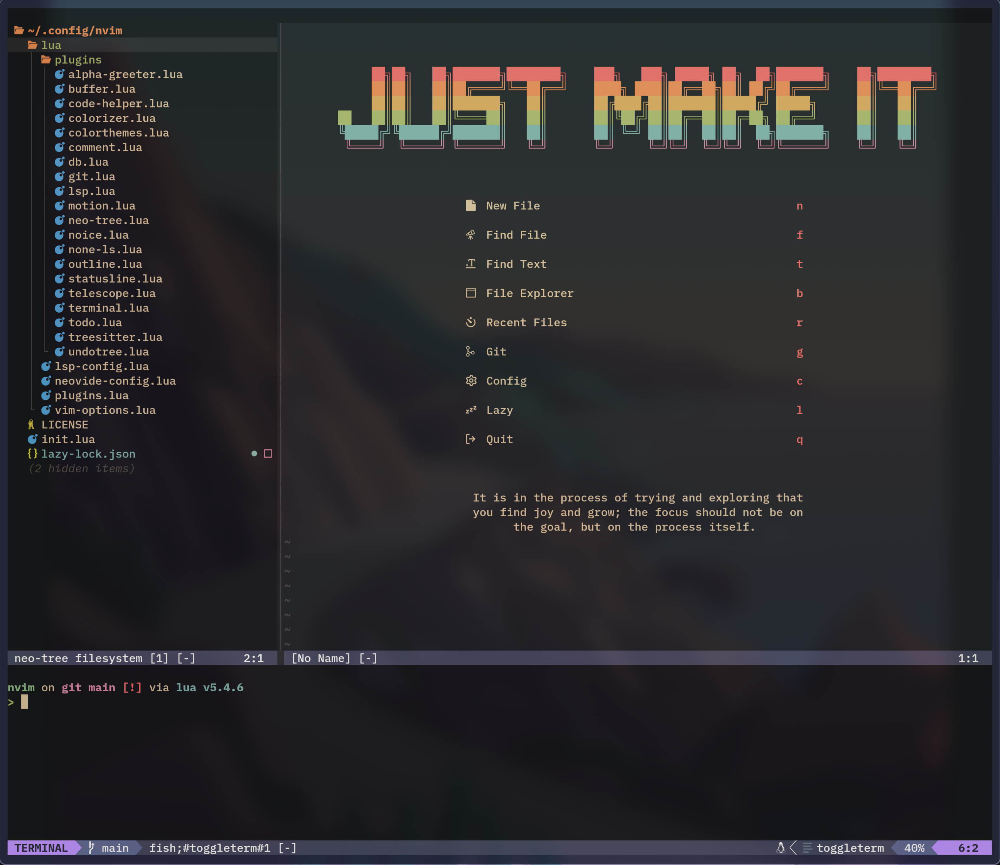

# My Neovim Config

## Installation
1. make a backup of your existing `nvim` folder (*if any*):
```shell
mv ~/.config/nvim ~/.config/nvim.bak
```

2. clean neovim related folders (*optional but recommended*):
```shell
mv ~/.local/share/nvim ~/.local/share/nvim.bak
mv ~/.local/state/nvim ~/.local/state/nvim.bak
mv ~/.cache/nvim ~/.cache/nvim.bak
```

3. clone this repository to `~/.config/nvim`
```shell
git clone https://github.com/justmakeit0821/neovim-config.git ~/.config/nvim
```

4. remove the git connection to this repository (*optional*)
```shell
rm -rf ~/.config/nvim/.git
```

5. remove the `/images` folder and the `README.md` file (*optional*):
```shell
rm -rf ~/.config/nvim/images README.md
```

## Dashboard Screenshot

